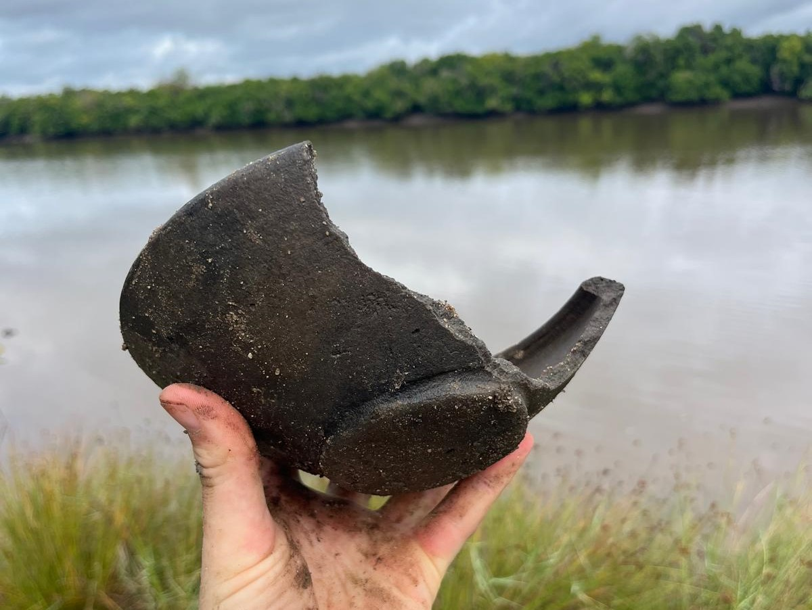
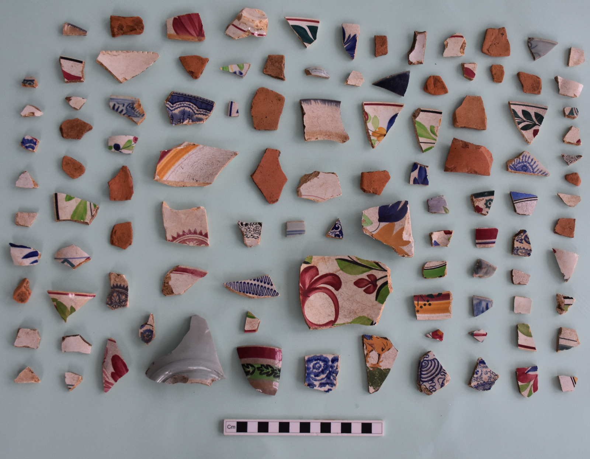

I am an archaeologist researching the historical archaeology and deep history of eastern Africa and the Indian Ocean from the medieval period to the 19th century.

My work traces the impacts of globalization, statecraft, and colonialism on landscapes, environments, and societies. I also address how small, mobile non-elite groups like fishers, farmers, hunters, merchants and pastoralists adapted to and shaped these processes. While my fieldwork is primarily based on the Swahili Coast of Kenya and Tanzania, my projects aim at comparative understandings of the early modern world in global perspective.

I am a Marie-Skłodowska Curie (MSCA) postdoctoral fellow at the McDonald Institute for Archaeological Research at Cambridge University (commencing January 2026). I am also currently [lecturing](https://ioa.ucla.edu/people/wolfgang-alders) at the UCLA Cotsen Institute of Archaeology. I earned my PhD from the Department of Anthropology at the University of California, Berkeley in 2022.

My research has been funded by the US National Science Foundation, the Wenner-Gren Foundation, the Andrew Mellon Foundation, Horizon Europe, Universitas 21, the American Philosophical Society, and the US National Endowment for the Humanities.

Medieval serving bowl from an archaeological site on the Pangani River in coastal Tanzania.

I write about:
* [social transformation and environmental diversification](https://link.springer.com/article/10.1007/s10437-023-09523-y)
* [open-access methods for archaeological predictive modeling with environmental datasets](https://journal.caa-international.org/articles/10.5334/jcaa.107)
* [material culture, economic networks, and non-elite political strategies](https://www.sciencedirect.com/science/article/pii/S0278416523000697)
* [studying coastal eastern African archaeological landscape palimpsests with satellite imagery](https://link.springer.com/article/10.1007/s10816-024-09644-x)
* [archaeology and remote sensing in rapidly urbanizing tropical environments](https://www.tandfonline.com/doi/full/10.1080/00934690.2024.2402962)
* [using drone imagery to assess the anthropogenic legacies of baobab trees in eastern Africa](https://www.sciencedirect.com/science/article/pii/S0305440325001293)
* Persistence on a perilous coast: Swahili responses to raiding, instability, and colonial violence in eastern Africa (accepted in _Current Anthropology_, in press!)
* Long-term urban trajectories in the eastern African tropics (accepted in the _Journal of Archaeological Research_, in press!)
* Forced displacement, disaster, and migration on the Swahili Coast (in review!)
* The effect of climate variation on early migrations to the eastern African coast (in review, co-author)

Recently, my work on human-baobab tree entanglements was featured in [The Conversation](https://theconversation.com/zanzibars-baobab-trees-used-to-be-a-valued-part-of-society-drone-images-help-prove-it-258996).

 
Imported ceramics from a rural plantation site near Zanzibar Stone Town. 18th to early 20th centuries CE.

## Projects
- My newest project, funded by Horizon Europe through a Marie-Skłodowska Curie fellowship at Cambridge University, is called Simulating African Agro-Pastoral Routes and Interactions (SAFARI). I am using archaeological, historical and geospatial methods to investigate the deep history of long-distance exchange among historical cattle pastoralists in Kenya, their interactions with urban societies, and their role in shaping the 19th-century caravan routes that connected eastern Africa to the Indian Ocean.

- I am also co-director of the [CALOR project in Tanzania](https://www.calorarchaeology.com), exploring social reorganization, connectivity, and adaptations to climate change and environmental disasters at the river-oceanic interface of Pangani Bay on the eastern African Swahili Coast, a key caravan node, from 600-1900 CE. My co-directors are Elinaza Mjema (University of Dar Es Salaam) and Ioana Dumitru (University of Sydney).

- I was a visiting research scholar (2024-2025) at the Institute for the Study of the Ancient World at New York University, where I used remote sensing and environmental datasets to model resource landscapes related to the exchange between eastern Africa and the Indian Ocean economic system of late antiquity and the medieval period.

- As a National Science Foundation Fellow at the Center for Advanced Spatial Technologies at the University of Arkansas, I directed the Zanzibar Urban-Rural Complexity Project (ZURCP) from 2022-2024. This project investigated urban emergence, change, and colonial transformations around Zanzibar Stone Town, one of the largest and longest-lasting urban centers on the Swahili Coast. We successfully leveraged satellite and drone imagery to model areas where archaeological surveys could detect archaeological sites within the interstices of the rapidly urbanizing modern city.

- For my PhD work at UC Berkeley, I demonstrated the deep history of Indigenous adaptations to marginal environments in Zanzibar that enabled participation in Indian Ocean exchange systems, overturning colonial narratives about the pristine wilderness of areas that later became plantations.

Analyzing ceramics with students and members of the Zanzibar Department of Museums and Antiquities.

## Why Africa?
Why practice archaeology in Africa? As an archaeologist, I am motivated by big questions. Why did people start living in large, specialized urban societies? How did people in the past exchange goods and ideas over vast distances, creating globalized societies? What types of environmental and climatic conditions impacted these changes, and how did people collectively shape and adapt to challenging environmental conditions? These complex activities are recent and emergent human experiments, the long-term outcomes of which are yet unclear. Likely, they will have drastic implications for the course of our species and planet, so it is vital to understand their timing, nature, and impacts for the present and future.

African archaeology demonstrates that processes leading to environmental change, food production, connectivity, and urbanism developed along unique and diverse pathways on the continent, in ways that continually force us to rethink global anthropological understandings of these trajectories. For instance, in East Africa, urban mercantile societies coexisted alongside hunter-gatherer, pastoralist, and intensified agriculturalist foodways for many centuries, and class stratification occurred in the absence of any overarching territorial state. Tropical environmental conditions also created unique urban-rural settlement arrangements that differ from comparable urban developments in other parts of the world. Finally, while African societies developed along unique trajectories, archaeology also shows that vast regions of the continent were deeply connected to the globalizing processes that shaped the modern world from a very early period. Archaeology is crucial for revealing connections that place African societies in global historical context.

Africa has enormous global significance but it is understudied, and therefore misunderstood. Investigating anthropological questions in Africa also means countering outdated assumptions about the region, like the notion that African societies were historically static, were dominated by environmental factors, or were outside of the global circuits of exchange that produced the modern world. These ideas could not be further from the truth. Archaeology, done in collaboration with African institutions and local communities, is uniquely suited to shed light on the dynamic societies of the African past within world history, to help address challenges of the African and global present.

Swahili tomb, Kunduchi, Tanzania. The circular divots used to hold Chinese porcelain bowls, which have since been removed.

My research draws on perspectives in historical ecology, landscape archaeology, and geospatial science. It has implications for sustainability and heritage conservation in modern tropical cities, especially in Africa where rapid urbanization will be a major factor in the sociopolitical and environmental transformations of the 21st century. I have extensive experience organizing and directing archaeological research projects. I integrate traditional survey and excavation techniques with computational and digital methods, advanced geospatial technologies, community-based research design, and training and mentoring for early career scholars from underrepresented and underserved backgrounds.

I am committed to decolonial approaches to archaeological practice. This means collaborative research engagements with African academic institutions and local communities and stakeholders. For my PhD and subsequent postdoctoral work in Zanzibar, this meant practicing archaeology in the Swahili language, holding community meetings that shaped research design, disseminating archaeological reports in Swahili to local communities, and training Tanzanian archaeologists in partnership with the Zanzibar Department of Museums and Antiquities, with which I maintain strong connections. With my new project in Pangani, our CALOR team has ongoing collaborations with the Department of Archaeology and Heritage Management at the University of Dar es Salaam, where our [Tanzanian-American-Australian research team](https://www.calorarchaeology.com/team-1) is committed to building local research capacity and providing training for Tanzanian undergraduate and graduate level stuudents. We are also in the process of developing new community outreach programs and collaborations with local residents, officials, and other stakeholders in the Pangani region where the work is proceeding.

Mangroves and the sea, taken on field survey. Fuoni, Zanzibar.

Last updated December 2025, Wolfgang Alders

