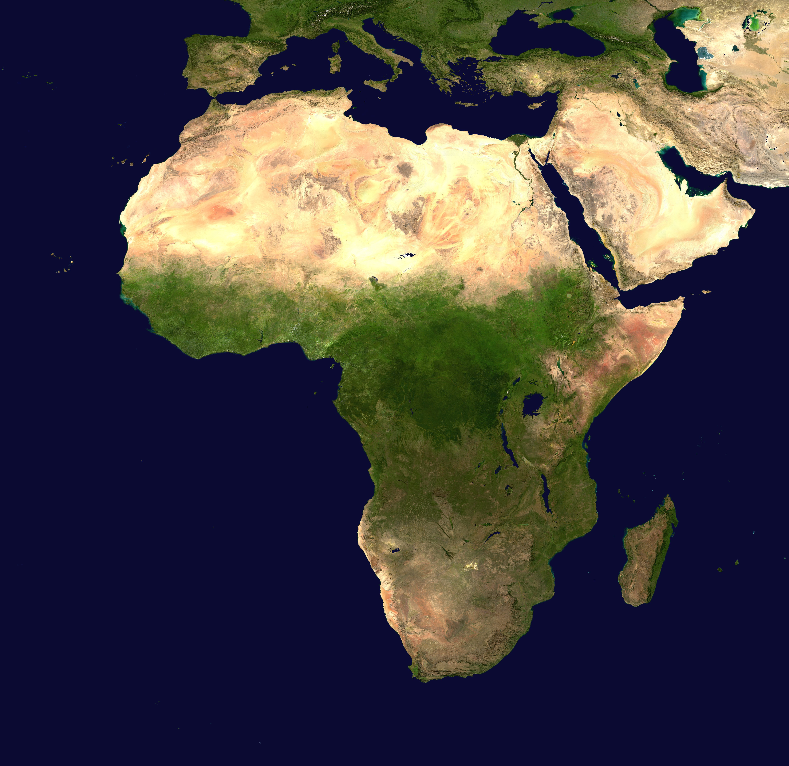
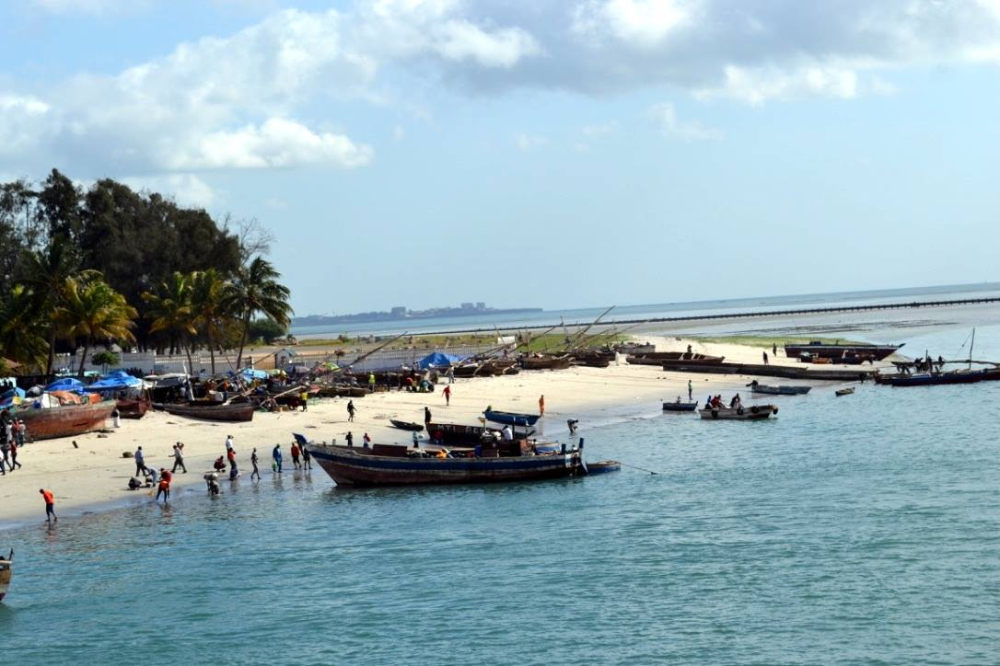

I am an anthropological archaeologist. My research explores non-elite impacts on sociopolitical and environmental change in the past. I am currently running research projects in Tanzania, investigating urban-rural interactions across coastal eastern Africa and the Indian Ocean over the last two millennia. Furthermore, I am committed to advancing public understandings of the interconnectedness and complexity of African and Indian Ocean societies in world history.

I am a National Science Foundation SBE postdoctoral fellow at the Center for Advanced Spatial Technologies (CAST) at the University of Arkansas, Fayetteville. I received my PhD from the Department of Anthropology at the University of California, Berkeley in 2022. My research has been funded by the National Science Foundation, the Wenner-Gren Foundation, the Andrew Mellon Foundation, and the National Endowment for the Humanities.

Analyzing ceramics with students and members of the Zanzibar Department of Museums and Antiquities, summer 2023.

## Why Africa?
Why practice archaeology in Africa? As an anthropological archaeologist, I am motivated by big questions: What processes led humans to start drastically modifying their environments through intensified food production? Why did people start living in large, specialized urban societies? Finally, how did people in the past exchange goods and ideas over vast distances, creating early globalized societies? These complex activities are recent and emergent human experiments, the long-term outcomes of which are yet unclear. Likely, they will have drastic implications for the course of our species and planet, so it is vital to understand their timing, nature, and impacts for the present and future.

What African archaeology demonstrates is that processes leading to environmental change, food production, connectivity, and urbanism developed along unique and diverse pathways on the continent, in ways that continually force us to rethink global anthropological understandings of these trajectories. For instance, in East Africa, urban mercantile societies coexisted alongside hunter-gatherer, pastoralist, and intensified agriculturalist foodways for many centuries, and class stratification occurred in the absence of any overarching territorial state. Concurrently, societies in West Africa settled in large, urban communities that did not exhibit the monumentality and hierarchical structures associated with stratified societies elsewhere. In southern Africa, elites accumulated and mobilized social wealth in ways that lead us to rethink assumptions about the relationship between control over land, surplus, and social inequality. In short, African archaeology forces us to *explain* rather than *assume* processes as they occurred elsewhere in Europe, Asia, and the Americas.

Africa has enormous global significance but it is vastly understudied, and therefore misunderstood. Investigating anthropological questions in Africa also means countering outdated assumptions about the region, like the notion that African societies were historically static, or dominated by environmental factors. These ideas could not be further from the truth, and archaeology is uniquely suited to reveal the dynamic societies of the African past, and help to address challenges of the African and global present.

## Research Agenda 
My research spans the last 2000 years of East African history, from the earliest migrations of pastoralists, foragers, and agriculturalists to the coast and offshore islands to the emergence of socially stratified, urban mercantile societies and the initiation of colonial rule. This long-term approach, tied together by a focus on non-elite, small-scale agency, bridges disciplinary siloes of prehistory-history or precolonial-colonial periodization which artificially limit our understandings of social processes. Methodologically, my engagement is with geospatial technologies for archaeology. I use GNSS mapping, UAVs, multispectral satellite imagery, historical maps, and spatial statistics to model environments and to help understand human settlement trends across large regions. In my work I seek to develop free and open-access methods for geospatial and archaeological research, enabling broader participation in archaeological science for places without the funding or licensing agreements to obtain cutting-edge geospatial hardware and software. In particular, I have translated GIS workflows from ArcGIS to QGIS and worked with freely available satellite imagery, like PlanetScope.

I am committed to collaborative engagements with local communities and stakeholders, public outreach, and decolonial approaches to archaeological practice. In Zanzibar, this has meant practicing archaeology in the Swahili language, holding community meetings during and after field surveys, disseminating archaeological reports in Swahili to local communities, and training Tanzanian archaeologists. I have developing collaborations with the Department of Museums and Antiquities in Zanzibar, and the Department of Archaeology and Heritage Management at the University of Dar es Salaam.

Rural Swahili pillar tomb, 18th century.

### Studying Swahili Urbanism in East Africa's Rapidly Urbanizing Modern Cities
Currently, I am directing the Zanzibar Urban-Rural Complexity Project (ZURCP) in Zanzibar, Tanzania, to investigate rural and non-elite responses to urbanization from the 8th to 19th centuries CE in the hinterland of Zanzibar Stone Town, a precolonial Swahili stone town that grew into a wealthy urban mercantile entrepôt the 18th and 19th centuries. Off-shore islands on the Swahili Coast of East Africa like Zanzibar are ideal places for understanding these dynamics, since they were both A.) caught up in broader socioecological trends like the initial migration of early iron-working agriculturalists to the coast, Swahili urbanism, and colonialism, and B.) geographically and environmentally constrained as physical islands, making them uniquely suited for modeling social and environmental systems.

One goal of this research is to pioneer geospatial techniques and survey methods for investigating the archaeology of rapidly urbanizing African cities. Archaeologists have long investigated urbanism at ruined precolonial sites like Shanga, Gedi, and Kilwa. However, some of the largest and most significant urban centers in coastal East Africa, like Lamu, Mombasa, and Zanzibar City, are underexplored because they lie within modern, rapidly urbanizing cities that make conventional survey methods difficult. Specific socioecological processes may have been at play to enable these cities to persist from the precolonial period to the present, and models of East African urbanism are skewed if these contexts are not taken into account. The future of the world is urban, and archaeologists will increasingly need to deal with survey and excavation in urbanizing places. Africa is urbanizing at the fastest rate of anywhere on the planet, so methodologies for investigating and conserving archaeological heritage in formerly rural places are urgently needed. Using high-resolution, low-cost satellite and UAV imagery, it is possible to plan surveys within the interstices of rapidly urbanizing environments in places like Zanzibar City for the first time.

Surveys have clarified a model of island settlement by Swahili agriculturalists, demonstrating that coastal stream networks and specific soil zones shaped the eventual emergence of Stone Town as a central place. With ceramic data, I have started to theorize about the integrative and autonomous activities of rural commoners, and the ways that participation by these groups within patron-client systems conditioned the emergence of urbanism. I have also continued thinking about later rural responses to colonial contact. One branch of my work has been to consider how rural stone mortuary complexes might reflect Swahili investments into territoriality as colonial rulers sought to exploit limited agricultural land in favorable environmental zones.

Systematic survey zones stratified around areas of rapid urbanization in Zanzibar City, Tanzania.

### Colonial Contact, Plantation Systems, and Indigenous Persistence
My dissertation research looked at the adaptations of rural Swahili communities that preceded and persisted through the establishment of plantation societies on Zanzibar by Omani settlers in the 18th and 19th centuries. Through systematic surveys, I demonstrated that precolonial Swahili communities founded villages in response to social demand for agricultural surplus. These village societies altered local landscapes in ways that structured the emergence of plantation systems centuries later. While urbanism in East Africa is often associated with trade networks, this project linked social stratification in Swahili towns to intensified agricultural production in rural areas that became plantations by the 19th century.

Beyond the clove plantation zones in Unguja's eastern region, we surveyed in areas long considered to be barren and agriculturally marginal. Our field surveys revealed a longer and more continuous, if less intensive, history of occupation in these areas compared to the agriculturally fertile western regions. Interviews with farmers attest to agricultural landscape modifications that involve cutting and digging out coral limestone bedrock. These techniques have incrementally transformed marginal agricultural soils into places capable of sustaining communities for centuries, and the eastern regions may have served as places of refuge during the turbulent colonial period.

Bananas and other crops planted in rocky, coralline limestone field plots in the eastern region of Unguja.

### Climate Change and Environmental Instability
With colleagues at the University of Dar Es Salaam and the University of Sydney, I have received funding to investigate first millennium CE coastal adaptations to climate change and environmental disasters on the Tanzanian mainland, at Pangani Bay. With fieldwork planned for 2024, our long-term goals are to investigate settlement shifts in response to climate oscillations in the southern hemisphere, and responses to acute environmental disasters like tsunamis and flooding events. We are modeling early Swahili adaptations to extreme environments in ways that might inform coastal resilience in Tanzania, a country which experiences the most destructive flooding of anywhere in East Africa.

Wolfgang Alders, 2024
